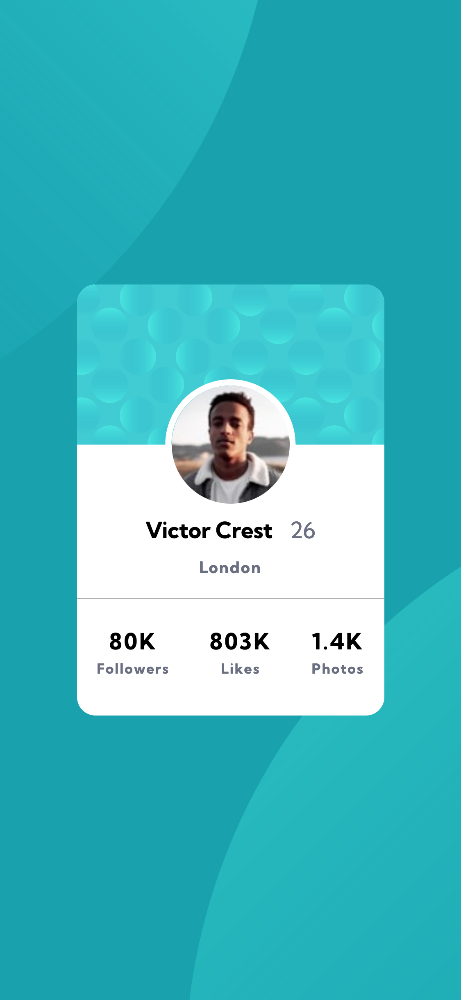

# Frontend Mentor - Profile card component solution

This is a solution to the [Profile card component challenge on Frontend Mentor](https://www.frontendmentor.io/challenges/profile-card-component-cfArpWshJ). Frontend Mentor challenges help you improve your coding skills by building realistic projects. 

## Table of contents

- [Overview](#overview)
  - [The challenge](#the-challenge)
  - [Screenshot](#screenshot)
  - [Links](#links)
- [My process](#my-process)
  - [Built with](#built-with)
  - [What I learned](#what-i-learned)
  - [Continued development](#continued-development)
  - [Useful resources](#useful-resources)
- [Author](#author)
- [Acknowledgments](#acknowledgments)

## Overview

### The challenge

- Build out the project to the designs provided

### Screenshot

### Links

- Solution URL: [Repo](https://github.com/sedaryildirim/profile-card-component)
- Live Site URL: [Live Site](https://sedaryildirim.github.io/profile-card-component/)

## My process

Mobile first workflow, found it quite difficult positioning some items at times but managed to get it working. Once mobile was completed, moved onto desktop version which was dead easy this time around.

### Built with

- Semantic HTML5 markup
- CSS custom properties
- Flexbox
- Mobile-first workflow

### What I learned

Discovered that multiple background images can be placed within a background tag, with locations that can be moved with the following snippet along with a seperate background color.

body { 
    background: url(/images/bg-pattern-top.svg), url(/images/bg-pattern-bottom.svg), var(--cc-dark-cyan-);
    background-repeat: no-repeat;
    background-position: right 40vw top -75vh, left 40vw top 47vh;
    overflow: hidden;
    }

### Continued development

Code cleanup in future & any potential bug fixes - also need better way to decern which fonts/weights/styles going with which headings (sketch files would be helpful here)

### Useful resources

- [Flexbox Froggy](https://flexboxfroggy.com/) - Flexbox Tutorial
- [Kevin Powell](https://www.youtube.com/KevinPowell) - HTML & CSS tutorirals
- [Web Dev Simplified](https://www.youtube.com/webdevsimplified) - @media & CSS tutorials

## Author

- Github - [Sedar Yildirim](https://github.com/sedaryildirim)
- Frontend Mentor - [@sedaryildirim](https://www.frontendmentor.io/profile/sedaryildirim)

## Acknowledgments

[Frontendmentor.io](https://www.frontendmentor.io/)

[Flexboxfroggy](https://flexboxfroggy.com/)

[Kevin Powell](https://www.youtube.com/KevinPowell)